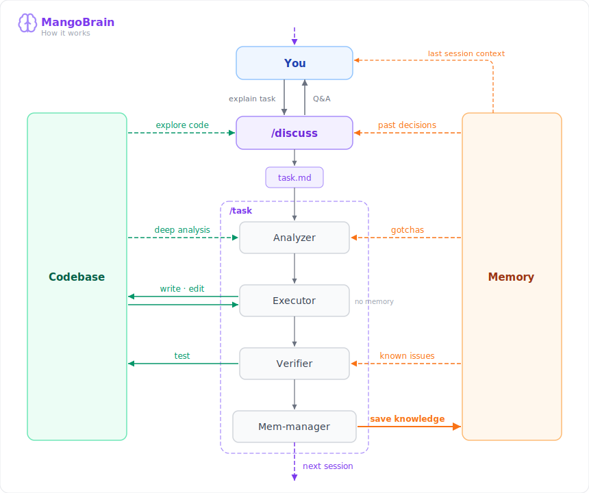
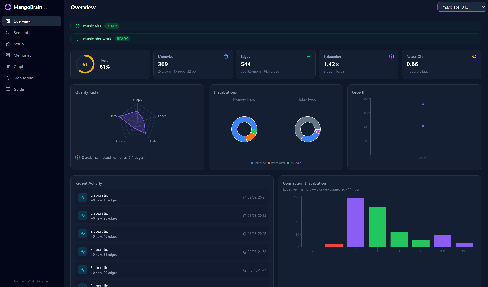
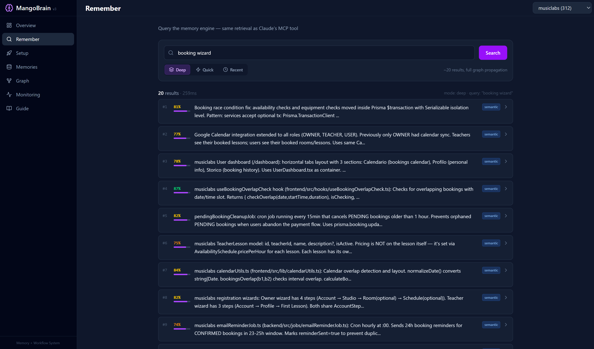
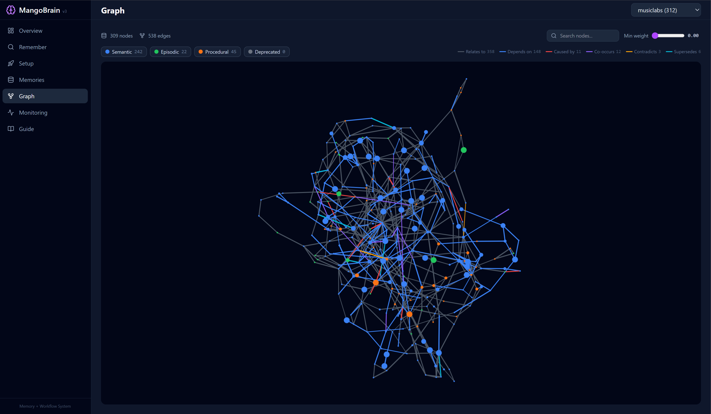
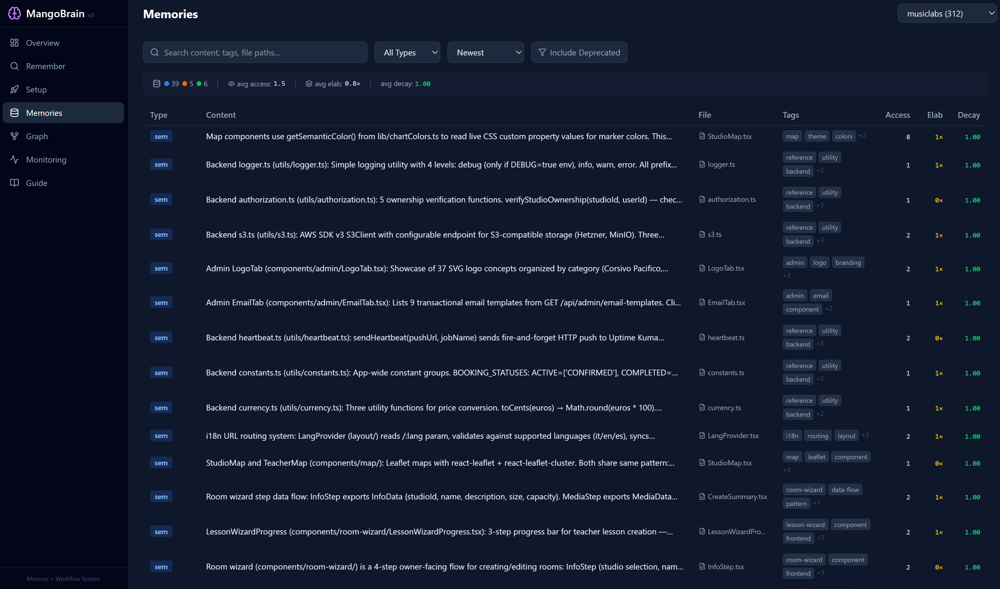
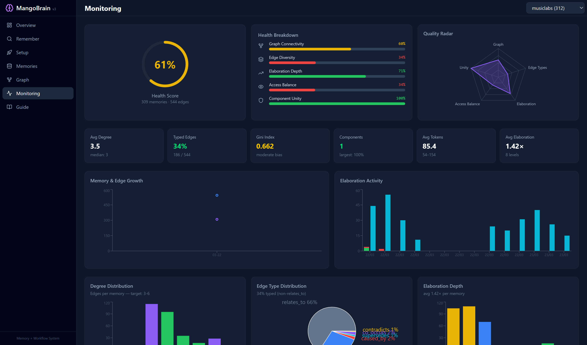

<p align="center">
  
</p>

<h1 align="center">MangoBrain</h1>

<p align="center">
  <strong>The learning layer for Claude Code</strong>
</p>

<p align="center">
  <em>Claude Code gets smarter the longer you use it.</em><br/>
  <sub>Plan with <code>/discuss</code>. Execute with <code>/task</code>. Knowledge saves itself.</sub>
</p>

<p align="center">
  <a href="https://pypi.org/project/mango-brain/"></a>
  
  
  
  
</p>

<p align="center">
  <a href="https://mangobrain.mango-dev.space">Website</a> · <a href="#getting-started">Install</a> · <a href="https://pypi.org/project/mango-brain/">PyPI</a>
</p>

---

**Session 1:** You tell Claude that prices must be stored in cents, not euros.
**Session 47:** Claude is about to write price logic. MangoBrain surfaces the memory. Claude already knows.

**No manual saving. No tagging.** The mem-manager captures knowledge at session close. The analyzer and verifier recall it when it matters.

---

## Why this exists

I build side projects at night after my day job. Claude Code is my pair-programmer, but every new session starts from scratch.

I tried the obvious approach first — `CLAUDE.md` files, rules, detailed docs. Anything to give Claude context. It works, until it doesn't. Files get stale. You forget to update them. Claude reads 500 lines of instructions but misses the one thing that matters for *this* specific task. And when the project grows, maintaining those files becomes a project in itself.

Then I tried memory MCP servers. They store things, but you're back to manual work — deciding what to save, writing explicit prompts to recall, maintaining yet another system on top of your code.

So I built what I actually needed: a system where memory handles itself. You work normally — plan with `/discuss`, execute with `/task` — and knowledge accumulates automatically. The mem-manager captures decisions, bugs, patterns at session close. The analyzer and verifier recall them when relevant. Zero effort from you.

After 500+ memories across two real projects, session 50 is genuinely better than session 1.

---

## How it works

<p align="center">
  
</p>

| | What happens | Codebase | Memory |
|---|---|---|---|
| **`/discuss`** | You explain the task. Claude explores code, recalls past decisions, brainstorms with full context. Output: `task.md`. | reads | reads |
| **Analyzer** | Deep analysis of the areas involved. Surfaces gotchas from memory before any code is written. | reads | reads |
| **Executor** | Writes code — 100% focused on implementation. No memory access by design. | writes | — |
| **Verifier** | Runs tests, checks quality, recalls known issues from memory before shipping. | reads | reads |
| **Mem-manager** | Captures decisions, bugs found, patterns learned. Zero effort from you. | — | **writes** |
| **Next session** | `/discuss` starts with everything the last cycle learned. The loop repeats — each cycle smarter. | | reads |

---

## Getting started

### 1. Install

```bash
pip install mango-brain
```

Lightweight install (~50MB). PyTorch and the embedding engine are installed in the next step, optimized for your hardware.

### 2. Setup your project

```bash
cd /path/to/your/project
mangobrain install
```

Detects your GPU (NVIDIA CUDA) or defaults to CPU. Installs PyTorch, configures Claude Code with skills, agents, and rules.

### 3. Start and initialize

```bash
mangobrain serve --api
```

Open http://localhost:3101 for the dashboard. Restart Claude Code to load the MCP server, then run `/brain-init` — a guided 14-step wizard that builds your project's initial memory from docs, code, and past sessions.

<details>
<summary>Or let Claude handle the setup</summary>

Open Claude Code in your project and paste:

```
Install MangoBrain for this project.
IMPORTANT: Use Python 3.11 or higher. Check available versions first (python --version,
py -3.12 --version, python3.12 --version, etc.) and use the correct one for pip install.
Run: pip install mango-brain  (using Python >= 3.11's pip)
Then run: mangobrain install
Then run: mangobrain serve --api (in background)
Then tell me to open http://localhost:3101 and to restart Claude Code.
After restart, I should run the brain-init skill to initialize memory.
```

</details>

---

## Dashboard

A 7-page control center to monitor, query, and explore your project's memory.

<p align="center">
  
</p>

<details>
<summary>More screenshots</summary>

| | |
|---|---|
|  **Remember** — Query memories like Claude does |  **Graph** — Visualize memory connections |
|  **Memories** — Browse and inspect |  **Monitoring** — Health, metrics, operation log |

</details>

---

## What's under the hood

<details>
<summary><strong>Memory model</strong></summary>

Every memory is 2-5 lines, English, atomic, self-contained. Three types with different decay rates:

| Type | Decay rate | What it stores | Lifespan |
|------|-----------|----------------|----------|
| **Episodic** | 0.01/day | Bugs, sessions, events | Fades in weeks |
| **Semantic** | 0.002/day | Architecture, decisions, patterns | Persists for months |
| **Procedural** | 0.001/day | Conventions, rules, how-tos | Nearly permanent |

Memories link through typed edges: `relates_to`, `depends_on`, `caused_by`, `co_occurs`, `contradicts`, `supersedes`. When a decision is updated, the old version gets automatically suppressed.

</details>

<details>
<summary><strong>Retrieval pipeline</strong></summary>

Three modes optimized for different moments:

| Mode | Results | When to use |
|------|---------|-------------|
| **Deep** | ~20, full graph propagation (α=0.3) | Session start, big picture planning |
| **Quick** | ~6, light propagation (α=0.15) | Mid-task targeted lookups |
| **Recent** | ~15, time-weighted + k-hop neighbors | WIP context, session resume |

Pipeline: embed query (BGE) → cosine similarity → apply decay scores → graph propagation (PageRank-style with signed edges) → knapsack selection (maximize relevance per token within budget).

</details>

<details>
<summary><strong>Skills & maintenance</strong></summary>

| Skill | Purpose | When |
|-------|---------|------|
| `/discuss` | Plan with memory context → produces `task.md` | Starting new work |
| `/task` | Execute with 4 agents + memory | Implementing features/fixes |
| `/memorize` | Manual session sync | Free sessions outside /task |
| `/brain-init` | Guided 14-step initialization | First time setup |
| `/elaborate` | Consolidate graph, build edges, resolve duplicates | Weekly |
| `/health-check` | Diagnose gaps, run targeted fixes | Monthly |
| `/smoke-test` | Test retrieval quality | After changes |

</details>

<details>
<summary><strong>MCP tools (15)</strong></summary>

`remember` · `memorize` · `update_memory` · `list_memories` · `extract_session` · `init_project` · `read_project_memory` · `prepare_elaboration` · `apply_elaboration` · `reinforce` · `decay` · `stats` · `diagnose` · `sync_codebase` · `setup_status`

</details>

<details>
<summary><strong>Configuration & CLI</strong></summary>

```toml
# mangobrain.toml (optional — defaults work for most setups)

[database]
path = "~/.mangobrain/mangobrain.db"

[embedding]
model = "auto"    # GPU → bge-large-en-v1.5 (1024d), CPU → bge-base-en-v1.5 (768d)
device = "auto"   # auto-detects CUDA

[decay]
episodic = 0.01
semantic = 0.002
procedural = 0.001
```

```bash
mangobrain serve              # MCP server (stdio)
mangobrain serve --api        # REST API + dashboard on :3101
mangobrain serve --all        # Both
mangobrain install            # Full interactive setup
mangobrain init -p NAME       # Initialize project in DB
mangobrain status -p NAME     # Setup progress
mangobrain doctor             # System health check
mangobrain dashboard          # Open dashboard in browser
```

</details>

---

## Requirements

- **Python** 3.11+
- **Claude Code** (Anthropic CLI)
- **GPU** optional — CUDA for best quality embeddings, CPU works fine

---

<p align="center">
  Built by <a href="https://github.com/Federico-Anastasi">Federico Anastasi</a>
  <br/>
  <sub>Because your AI pair-programmer shouldn't have amnesia.</sub>
</p>
